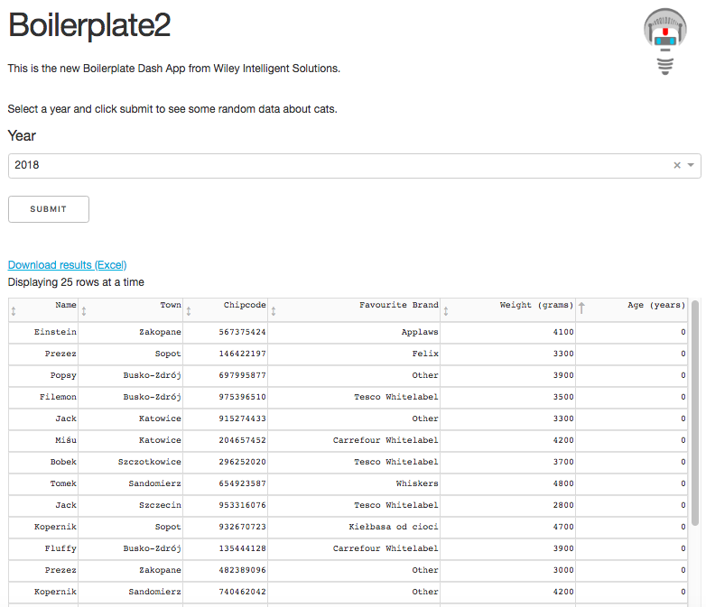
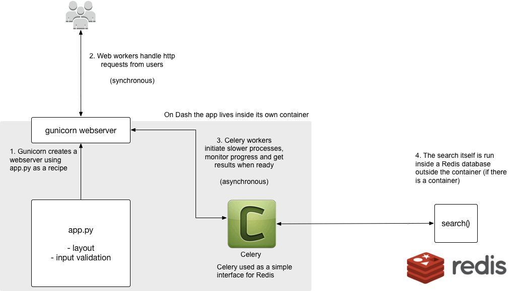

# Wiley Dash Boilerplate2

This is the new Boilerplate Dash App from Wiley Intelligent Solutions and it looks like this:



## Key features

- Execution of long-running tasks on a Redis database via Celery (no more server timeouts or flashing screens!)
- Display/interrogate results using DataTable
- Download results in Excel format via Amazon S3
- Verbose logging in the Terminal to help learning and debugging

## Deployment

### Run locally

Install [Redis](https://redis.io/) and follow the instructions to make it start automatically

Install [Heroku CLI](https://devcenter.heroku.com/articles/heroku-cli)

Clone this repo:

```bash
$ git clone https://github.com/WileyIntelligentSolutions/wiley-dash-boilerplate2
$ cd wiley-dash-boilerplate3
```

Create a new environment, activate it and install packages:

```bash
$ cd wiley-dash-boilerplate2
$ conda create -n wiley-dash-boilerplate2
$ source activate wiley-dash-boilerplate2
$ pip install -r requirements.txt
```

We also recommend ensuring that all packages in your new environment are fully up-to-date.  This may take a few minutes:

```bash
$ pipdate
```

Do you have access to an S3 bucket to enable results downloading in the app?  If so follow the next set of instructions as they are, otherwise go to `config.py` and change `DISABLE_S3 = False` to `DISABLE_S3 = True` and omit the S3 environment variables in .env

You can also omit `DASH_DOMAIN_BASE` if you are only running this locally.  `PATH_BASED_ROUTING` is also only required if you enable user authentication (see later).

Populate .env with the following:

```bash
REDIS_URL=redis://0.0.0.0:6379
APP_URL=http://0.0.0.0:5000
PLOTLY_USERNAME=your-plotly-username
PLOTLY_API_KEY=your-plotly-api-key
PLOTLY_DOMAIN=your-plotly-domain
PLOTLY_API_DOMAIN=your-plotly-api-domain
DASH_DOMAIN_BASE=your-dash-domain-base
PATH_BASED_ROUTING=True
PLOTLY_SSL_VERIFICATION=True
S3_BUCKET_NAME=your-s3-bucket-name
S3_ACCESS_KEY_ID=your-s3-api-key-id
S3_SECRET_ACCESS_KEY=your-s3-api-secret-key
```

Start the server

```bash
$ heroku local
```

### Deploy to Dash

Update requirements.txt:

```bash
$ pip freeze > requirements.txt
```

Check that requirements.txt contains `gunicorn`, `redis` and `celery[redis]`.  If not, add them at the end.  Following standard practice, we will create 2 apps: One production (boilerplate2) and one as a dev environment (boilerplate2-dev)

In the Dash Deployment Server:

Create new Databases called `boilerplate2` and `boilerplate2-dev`

#### Deploy Production App

Create a new Dash app called `boilerplate2` and connect it to the `boilerplate2` Redis database.  Follow these instructions to add your SSH credentials and set your `.ssh/config` to allow both pushing of git repos and connection to the dokku client:

https://dash.plot.ly/dash-deployment-server/ssh

In Settings, populate the following environment variables:

```bash
PLOTLY_USERNAME=your-plotly-username
PLOTLY_API_KEY=your-plotly-api-key
PLOTLY_DOMAIN=your-plotly-domain
PLOTLY_API_DOMAIN=your-plotly-api-domain
DASH_DOMAIN_BASE=your-dash-domain-base
S3_BUCKET_NAME=your-s3-bucket-name
S3_ACCESS_KEY_ID=your-s3-api-key-id
S3_SECRET_ACCESS_KEY=your-s3-api-secret-key
```

Deploy:

```bash
$ git push plotly master
```

Scale-up worker (don't forget to do this!!!):

```bash
$ ssh dokku@your-dash-deployment-server ps:scale boilerplate2 worker=1
```

The production app should now be online.

#### Deploy Dev App

Create a new Dash app called `boilerplate2-dev` and connect it to the `boilerplate2-dev` Redis database. Then follow the above instructions except:

In `config.py` change `DASH_APP_NAME=boilerplate2` to `DASH_APP_NAME=boilerplate2-dev`

```bash
$ git remote add dev https://your-dash-deployment-server/GIT/boilerplate2-dev
$ git push dev master
$ ssh dokku@your-dash-deployment-server ps:scale boilerplate2-dev worker=1
```

Top tip:  Working on a branch and want to test deploy before merging?  Push the local branch to the remote master like this:

```bash
$ git push dev your-local-branch:master
```

## How to customize this app

Basically, you can put any kind of search or query you want in [search.py](search.py) and change the app layout to receieve a query from the user and display the results in [app.py](app.py)
 
### How does this app work?

This app supports running longer-running tasks without getting into trouble with server timeouts and browser timeouts.  We do this by running slower processes away from the app asynchronously, like a waiter in a restaurant collects orders from a customer, passes the order to the kitchen and, inbetween serving other customers, checks in with the kitchen periodically to see which orders are ready to collect.  In our case, the "waiters" are gunicorn workers and the "kitchen" is Redis.  Celery acts as a simple, Pythonic interface to Redis.



When you deploy to dash, the webserver and all supporting files exist in a container, but the function or functions that run your slower processes are exported to a Redis database running outside the container on the Dash server.

### What do the files do?

[config.py](config.py)

Contains some settings that are not appropriate for storing in environment variables (IMO).

Walk through the comments and set the flags as required, e.g. if you don't want to enable S3 just yet, set `DISABLE_S3 = True`.  See [plot.ly docs](https://dash.plot.ly/) for information of authentication and privacy if you want to enable these features.

[search.py](search.py)

All the search and querying functionality of your app.

The core of your app should be a function to search or query a database, API, static file, etc. and return a set of results.  This function should be developed and tested outside of any web app framework (otherwise you can get in a right old mess) then copy-pasted into the `search` function defined in `search.py`.  `search` must always return a dict type so that a) the data can be handled by Celery, and b) the data can be loaded into the DataTable.

[tasks.py](tasks.py)

Connect your functions in `search.py` to Celery and store all results persistently on S3.

You should only need to change this code if you want to pass multiple arguments to your search function in `search.py`.  See [Celery docs](http://docs.celeryproject.org/en/latest/userguide/calling.html) for how to implement this properly.

[loading.py](loading.py)

Jobs to be performed after the app is deployed.

If your app needs to load data or run some kind of query on deployment, e.g. to populate menu options, you can include functions to do that here.

[app.py](app.py)

The app itself.

Walk through this fully-commented code to customize the look, feel and functionality of your app.

[.env](.env)

You will need to create this yourself because it is not included in the git repo.  When running locally, store you credentials in this file.  NEVER include credentials in your code and never add .env files to your git repos!

[.gitignore](.gitignore)

This tells git which files to ignore (e.g. .env, .csv, and so on).

[apt-packages](apt-packages)

This is just an add-on for Redis - nothing to see here.

[auth.py](auth.py)

This is just a wrapper for Dash authentication - nothing to see here either.

[LICENSE](LICENSE)

Just a standard git file to show which license we're using (MIT in this case).

[requirements.txt](requirements.txt)

A list of packages to install when we deploy (or if you've just downloaded this repo and want to run it locally - see above)

[runtime.txt](runtime.txt)

This tells your Dash server which version of Python you want to run.  Ideally you should use the latest version of Python supported by your Dash server.

[slogger.py](slogger.py)

This is just a very simple tool we made to log messages in the Terminal for debugging.

[assets/*]()

This folder contains any images you want to display in the app layout.

[reports/*]()

This folder is where query results are stored and - if enabled - transferred to S3.  When deployed on Dash, these files are only temporary.  When running locally, they are permanent and you'll have to manually delete them.
